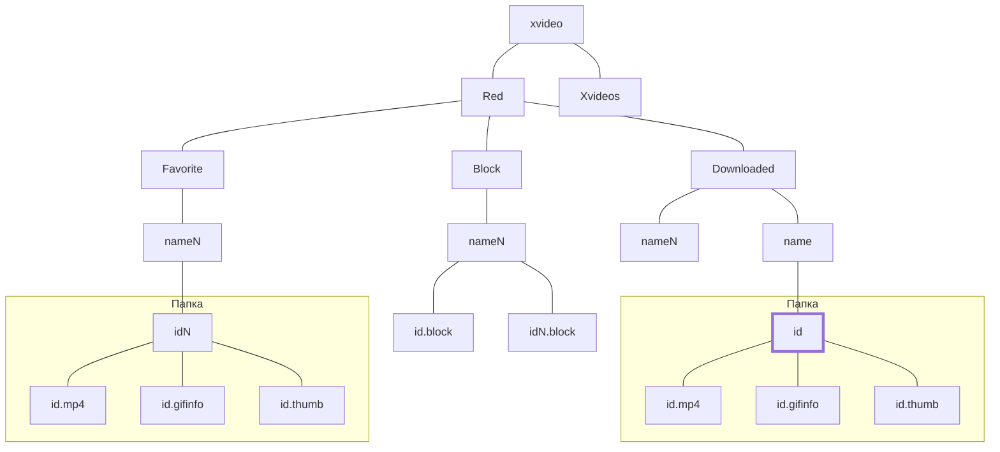

```mermaid
flowchart TB
main[xvideo]
red[Red]
xvideos[Xvideos]
downloaded[Downloaded]
block[Block]    
    
main --- red
main --- xvideos

red --- downloaded 
red --- block

block --- nameN  --- id.block
nameN --- idN.block


downloaded --- name1[name]
downloaded --- name2[nameN]

name1 --- id

style id fill:#3f,stroke:#3,stroke-width:4px
    
subgraph folderх[Папка]
    id --- mp4[id.mp4]
    id --- info[id.gifinfo]
    id --- thumb[id.thumb]
end

red --- favorite[Favorite]
favorite --- nameFavoriteN[nameN]
nameFavoriteN --- idN[idN]

subgraph folderFavorite[Папка]
        idN --- mp4F[id.mp4]
        idN --- infoF[id.gifinfo]
        idN --- thumbF[id.thumb]
end


```
